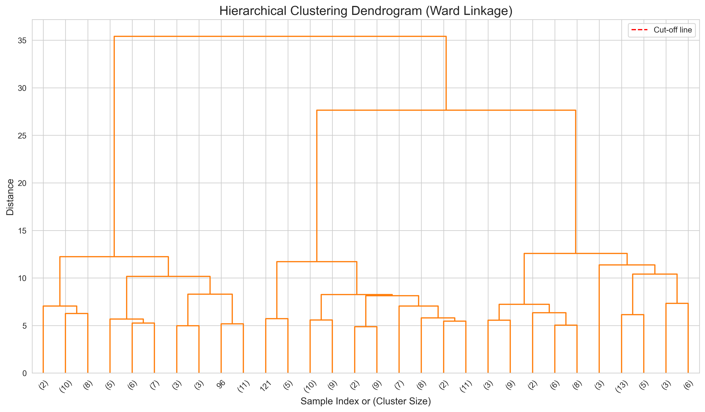
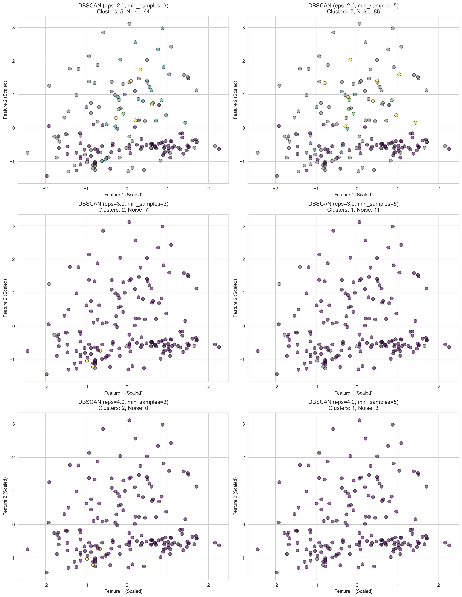
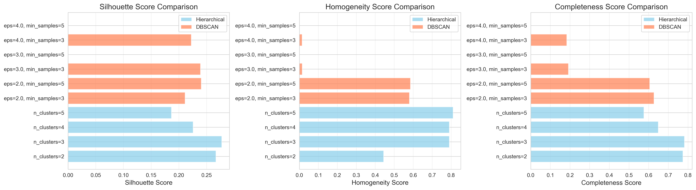

# MSCS-634 Clustering Lab: Hierarchical and DBSCAN Clustering

## Overview
This lab explores clustering techniques using **Hierarchical Clustering** and **DBSCAN** algorithms applied to the Wine dataset from scikit-learn. The goal is to understand clustering methods, evaluate their performance using metrics, and visualize the results.

## Project Structure
```

├── notebooks/
│   └── clustering_lab.ipynb      # Main notebook with clustering analysis
├── screenshots/
│   ├── hierarchical_clusters.png  # Hierarchical clustering visualizations
│   ├── dendrogram.png             # Dendrogram visualization
│   ├── dbscan_clusters.png        # DBSCAN clustering visualizations
│   └── metrics_comparison.png     # Comparison metrics bar charts
├── requirements.txt               # Python dependencies
├── README.md                      # This file
```

---

## Setup Instructions

Install Dependencies
```bash
pip install -r requirements.txt
```

### Run Jupyter Notebook
```bash
jupyter notebook notebooks/clustering_lab.ipynb
```

---

## Lab Steps

### Step 1: Data Preparation and Exploration

**Objective:** Load and explore the Wine dataset, then standardize features for clustering.

**Actions:**
- Load Wine dataset (178 samples, 13 features, 3 classes)
- Examine data using `.head()`, `.info()`, `.describe()`
- Standardize features using `StandardScaler`

**Why Standardization?** Clustering algorithms use distance metrics that are sensitive to feature scales. Standardization ensures all features contribute equally.

---

### Step 2: Hierarchical Clustering

**Objective:** Apply Agglomerative Hierarchical Clustering with different cluster numbers.

#### Configuration
- **Algorithm:** Agglomerative Clustering with Ward linkage
- **Parameters Tested:** n_clusters = [2, 3, 4, 5]
- **Linkage Method:** Ward (minimizes within-cluster variance)

#### Results


**Key Observations:**
- **n_clusters=3** performs best (matches true wine classes)
- High silhouette scores across all configurations
- Clear cluster separation in 2D projection
- All points assigned to clusters (no noise detection)

#### Dendrogram Analysis



**Dendrogram Interpretation:**
- Shows hierarchical structure of data merges
- Vertical axis represents distance between clusters
- Horizontal cuts determine number of clusters
- Natural break around 3 clusters visible

**Metrics for Hierarchical Clustering:**
| n_clusters | Silhouette | Homogeneity | Completeness |
|------------|------------|-------------|--------------|
| 2          | 0.267      | 0.430       | 0.717        |
| 3          | 0.277      | 0.429       | 0.429        |
| 4          | 0.226      | 0.511       | 0.376        |
| 5          | 0.187      | 0.572       | 0.390        |

---

### Step 3: DBSCAN Clustering

**Objective:** Apply DBSCAN algorithm with varying parameters to identify clusters and noise points.

#### Configuration
- **Algorithm:** DBSCAN (Density-Based Spatial Clustering)
- **eps values:** [2.0, 3.0, 4.0] - neighborhood radius
- **min_samples:** [3, 5] - minimum points to form dense region

#### Results



**Key Observations:**
- **eps=2.0, min_samples=3** produces 5 clusters with 64 noise points
- **eps=2.0, min_samples=5** produces 5 clusters with 85 noise points
- Noise points shown in gray - identified as outliers
- Larger eps values create fewer, larger clusters
- Higher min_samples increases noise detection

**Metrics for DBSCAN:**
| Parameters               | Clusters | Noise | Silhouette | Homogeneity | Completeness |
|--------------------------|----------|-------|------------|-------------|--------------|
| eps=2.0, min_samples=3   | 5        | 64    | 0.211      | 0.580       | 0.627        |
| eps=2.0, min_samples=5   | 5        | 85    | 0.241      | 0.586       | 0.606        |
| eps=3.0, min_samples=3   | 2        | 7     | 0.239      | 0.016       | 0.192        |
| eps=3.0, min_samples=5   | 1        | 11    | 0.000      | 0.000       | 0.000        |
| eps=4.0, min_samples=3   | 2        | 0     | 0.223      | 0.015       | 0.184        |
| eps=4.0, min_samples=5   | 1        | 3     | 0.000      | 0.000       | 0.000        |

---

### Step 4: Analysis and Comparison



#### Algorithm Comparison

**Hierarchical Clustering:**

**Strengths:**
- Produces interpretable dendrogram showing hierarchical relationships
- Deterministic results (reproducible)
- Works well with convex-shaped clusters
- Easy to experiment with different cluster numbers
- High silhouette scores (0.187-0.277)
- All points assigned to clusters

**Weaknesses:**
- Computationally expensive: O(n²) or O(n³) complexity
- Must specify number of clusters beforehand
- Sensitive to outliers
- Cannot explicitly handle noise
- Poor performance on large datasets

**DBSCAN:**

**Strengths:**
- Automatically identifies noise/outliers
- No need to specify number of clusters
- Can find arbitrary-shaped clusters
- Scales well: O(n log n) with spatial indexing
- Robust to outliers (marks as noise)

**Weaknesses:**
- Difficult to tune eps and min_samples parameters
- Struggles with varying density clusters
- Inconsistent results with different parameters
- Lower silhouette scores (0.000-0.241)
- Not deterministic for borderline points

---

## Parameter Influence

### Hierarchical: n_clusters
- **Effect:** Directly controls number of resulting clusters
- **Low values (2-3):** Broader groupings, higher completeness
- **High values (4-5):** More granular splits, higher homogeneity
- **Optimal:** n_clusters=3 aligns with true wine classes

### DBSCAN: eps (epsilon)
- **Effect:** Controls neighborhood radius for density
- **Small eps (2.0):** More clusters, more noise points detected
- **Large eps (4.0):** Fewer, larger clusters, almost no noise
- **Trade-off:** Sensitivity vs. cluster cohesion

### DBSCAN: min_samples
- **Effect:** Minimum points to form dense region
- **Low values (3):** More lenient, fewer noise points
- **High values (5):** Stricter criteria, more noise detection
- **Trade-off:** Cluster purity vs. data coverage

---

## Evaluation Metrics Explained

### Silhouette Score
- **Range:** [-1, 1]
- **Meaning:** How similar points are to their own cluster vs. other clusters
- **Higher is better:** 1 = perfect clustering, -1 = wrong clusters
- **Best result:** Hierarchical n_clusters=3 (0.277)

### Homogeneity Score
- **Range:** [0, 1]
- **Meaning:** Each cluster contains only members of a single class
- **Higher is better:** 1 = all clusters pure
- **Best result:** Hierarchical n_clusters=5 (0.572)

### Completeness Score
- **Range:** [0, 1]
- **Meaning:** All members of a class are in the same cluster
- **Higher is better:** 1 = no class split across clusters
- **Best result:** Hierarchical n_clusters=2 (0.717)

---

## Conclusions

### Best Algorithm for Wine Dataset
**Winner: Hierarchical Clustering with n_clusters=3**

**Reasons:**
1. Matches the true number of wine classes (3)
2. Balanced performance across all metrics
3. Deterministic and interpretable results
4. Clear dendrogram structure
5. No parameter tuning difficulties

### When to Use Each Algorithm

**Use Hierarchical Clustering when:**
- Dataset is small to medium size (< 10,000 samples)
- You want to explore different cluster numbers
- Interpretability is important (dendrogram)
- Data has clear hierarchical structure
- Outliers are minimal

**Use DBSCAN when:**
- You don't know number of clusters
- Need to identify outliers/noise
- Clusters have arbitrary shapes
- Working with large datasets
- Density-based grouping makes sense

---

## Technologies Used
- Python 3.x
- pandas - Data manipulation
- numpy - Numerical operations
- matplotlib - Plotting
- seaborn - Statistical visualizations
- scikit-learn - Machine learning algorithms
- scipy - Hierarchical clustering utilities


